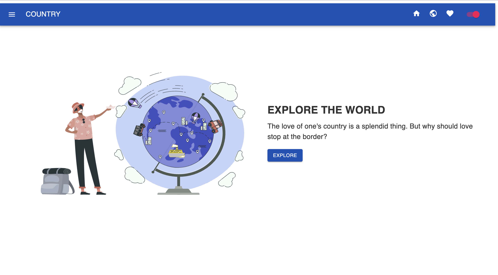
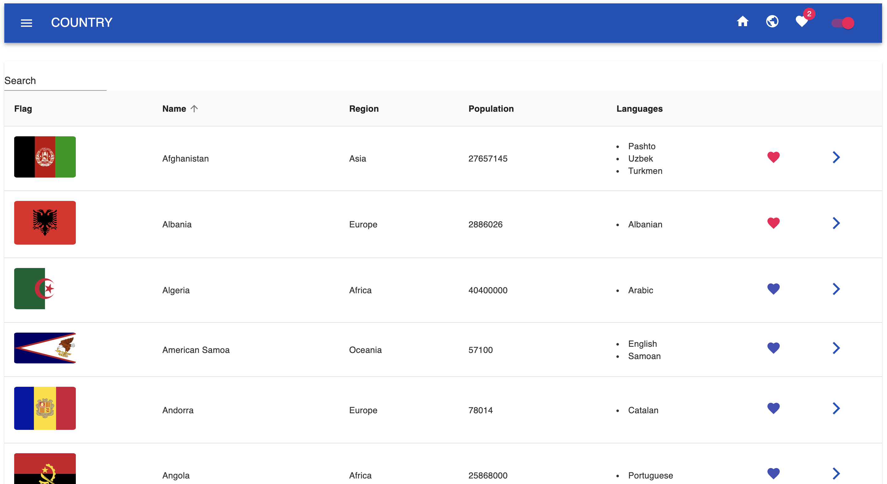
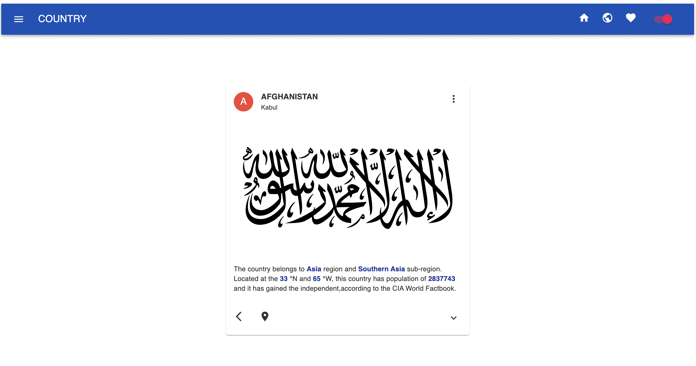

# Country project

## Tech stack

- Redux
- Redux-thunk
- Context
- Local Storage
- MUI for style

## Website function

- Search country by name
- Add favorite and remove country then store to local storage
- Sort by name, population, language and region
- Change dark/ light theme using context theme

## The sample

Landing page with animation

Country page with country list and page function

Each country page

